遮 ê 圖是用來介紹鳥仔 ê 身軀部位，翻譯來自[鳥仔身軀部位](./anatomy.md)，目前大部分 ê 部位猶無正式 ê 台語稱呼，我盡量參考其他語言來翻譯。

## 雀 tshiok

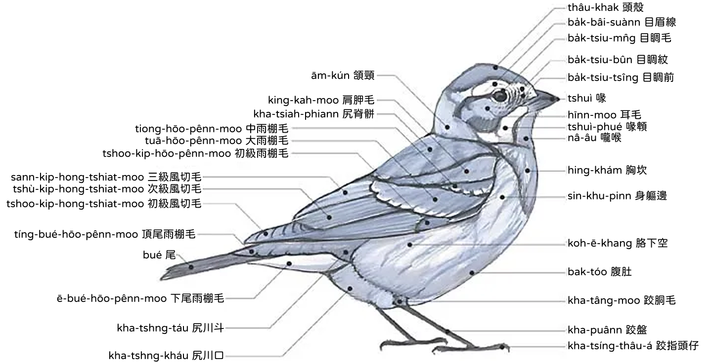

---

## 頭 thâu

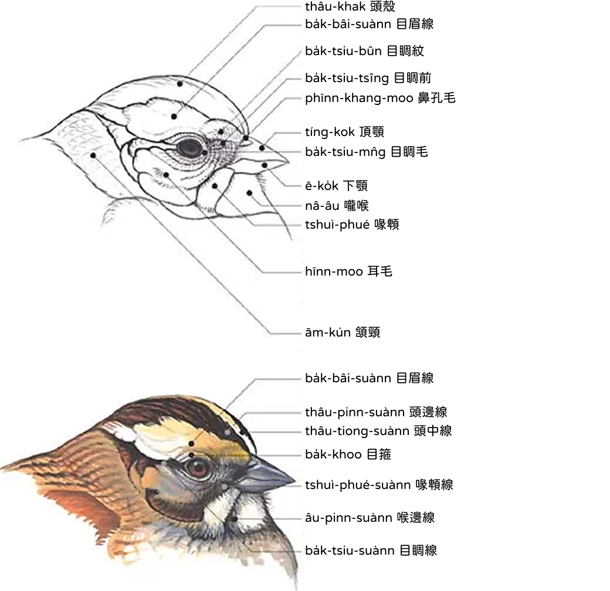

---

## 身軀 sin-khu

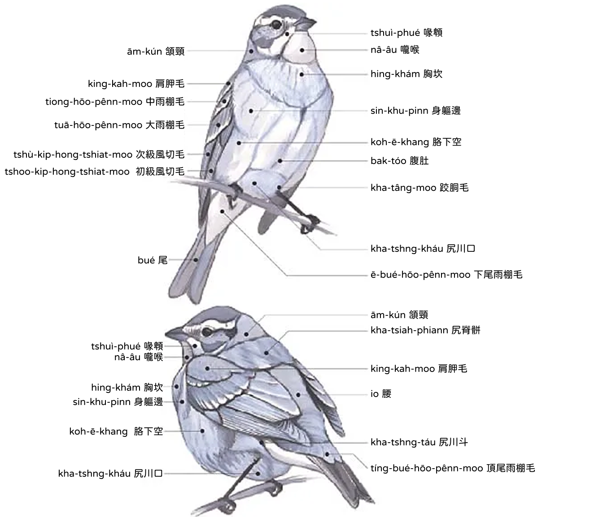

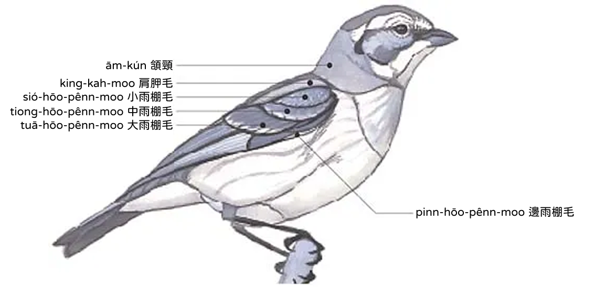

---

## 翼 si̍t

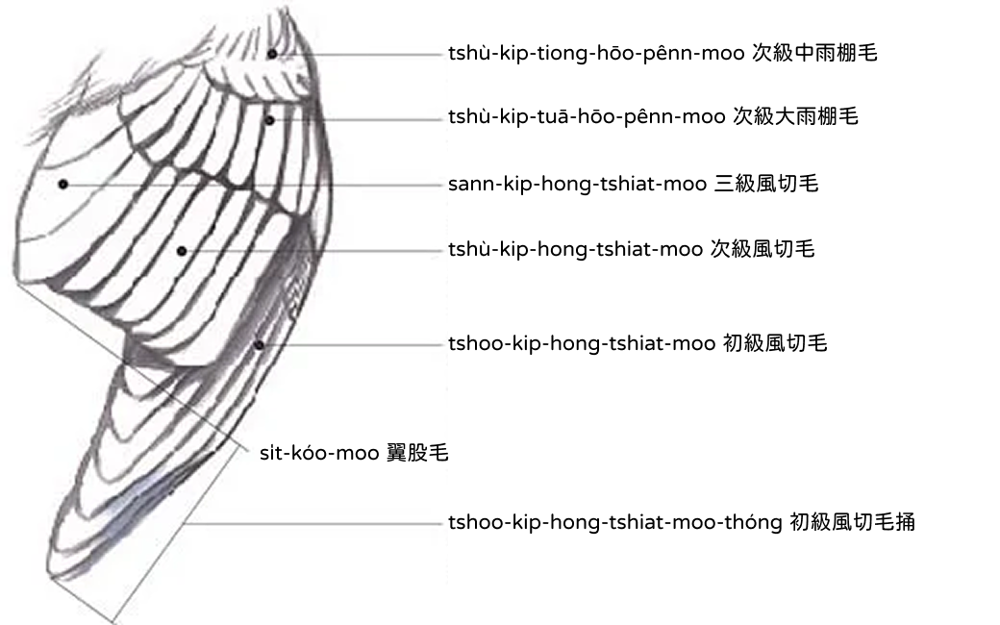

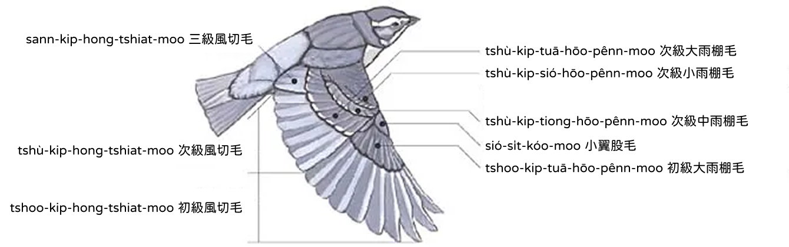

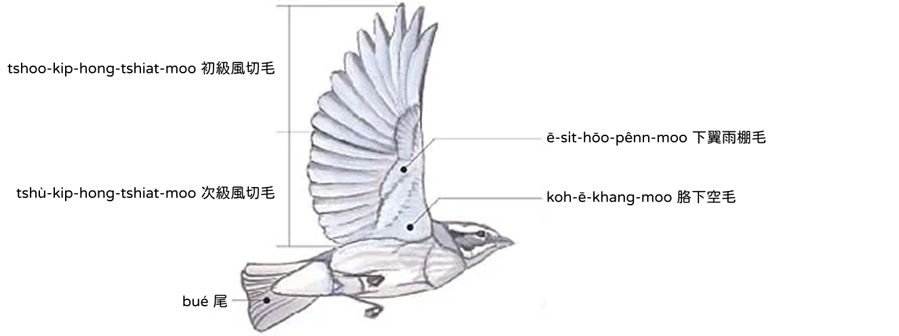

---

## 鷸鴴 lu̍t-hîng

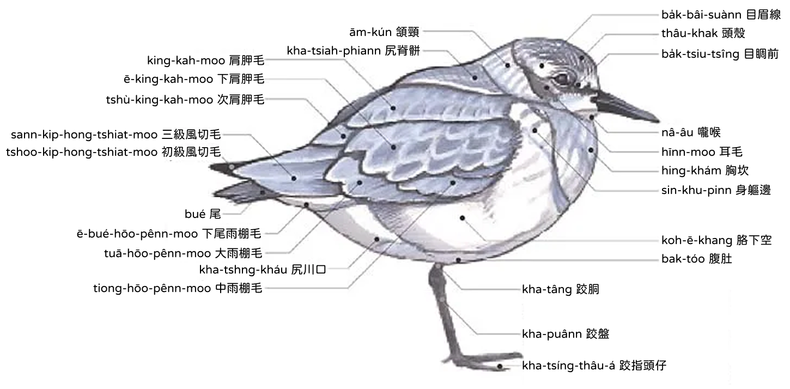

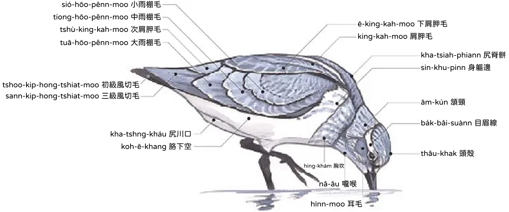

---

## 鴨 ah

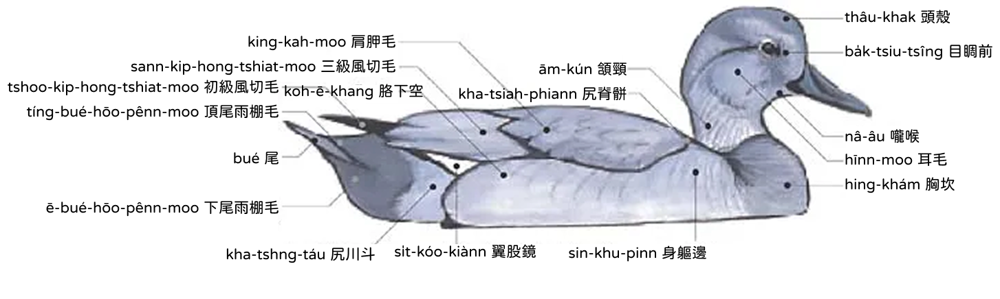

---

## 鷗 oo

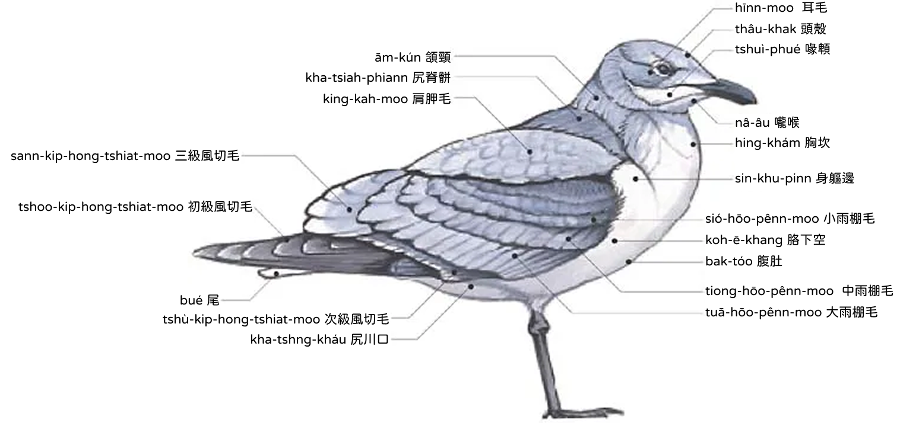

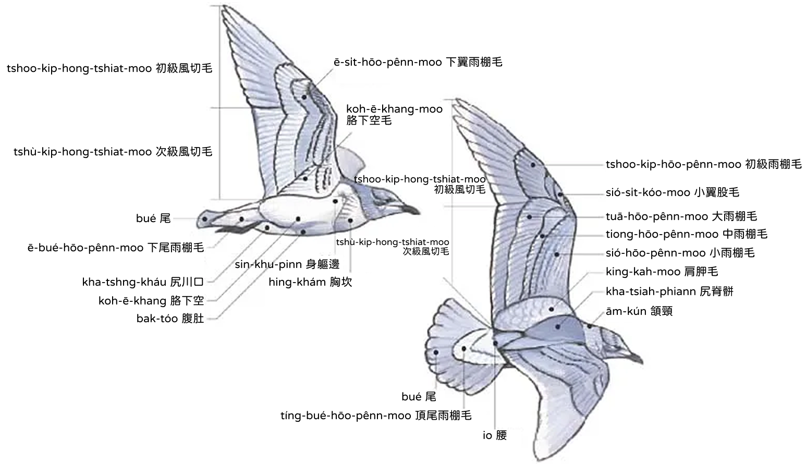

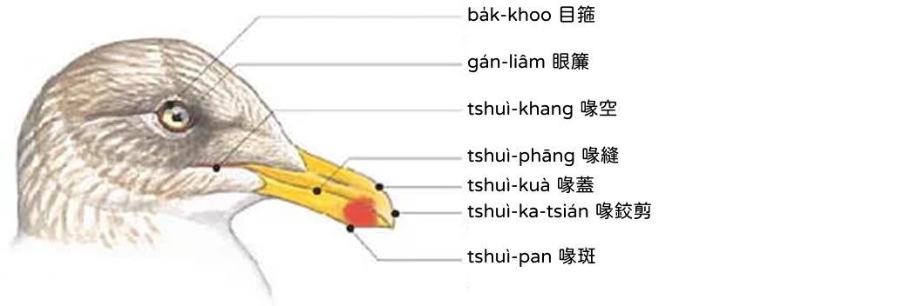

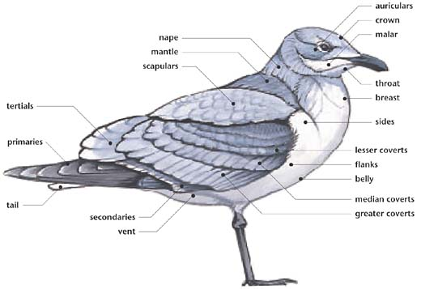

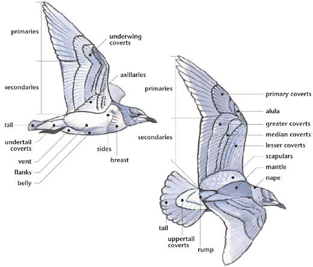

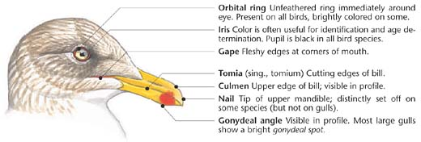

| English | 台羅 | 漢字 |
|---|---|---|
| auriculars | hīnn-moo | 耳毛 |
| crown | thâu-khak | 頭殼 |
| malar | tshuì-phué | 喙䫌 |
| nape | ām-kún | 頷頸 |
| mantle | kha-tsiah-phiann | 尻脊骿 |
| scapulars | king-kah-moo | 肩胛毛 |
| tertials | sann-kip-hong-tshiat-moo | 三級風切毛 |
| primaries | tshoo-kip-hong-tshiat-moo | 初級風切毛 |
| secondaries | tshù-kip-hong-tshiat-moo | 次級風切毛 |
| tail | bué | 尾 |
| vent | kha-tshng-kháu | 尻川口 |
| throat | nâ-âu | 嚨喉 |
| breast | hing-khám | 胸坎 |
| sides | sin-khu-pinn | 身軀邊 |
| lesser coverts | sió-hōo-pênn-moo | 小雨棚毛 |
| median coverts | tiong-hōo-pênn-moo | 中雨棚毛 |
| greater coverts | tuā-hōo-pênn-moo | 大雨棚毛 |
| flanks | koh-ē-khang | 胳下空 |
| belly | bak-tóo | 腹肚 |
| underwing coverts | ē-si̍t-hōo-pênn-moo | 下翼雨棚毛 |
| axillaries | koh-ē-khang-moo | 胳下空毛 |
| primary coverts | tshoo-kip-hōo-pênn-moo | 初級雨棚毛 |
| alula | sió-si̍t-kóo-moo | 小翼股毛 |
| uppertail coverts | tíng-bué-hōo-pênn-moo | 頂尾雨棚毛 |
| undertail coverts | ē-bué-hōo-pênn-moo | 下尾雨棚毛 |
| rump | io | 腰 |
| orbital ring | ba̍k-khoo | 目箍 |
| iris | gán-liâm | 眼簾 |
| gape | tshuì-khang | 喙空 |
| tomia | tshuì-phāng | 喙縫 |
| culmen | tshuì-kuà | 喙蓋 |
| nail | tshuì-ka-tsián | 喙鉸剪 |
| gonydeal angle | tshuì-pan | 喙斑 |
